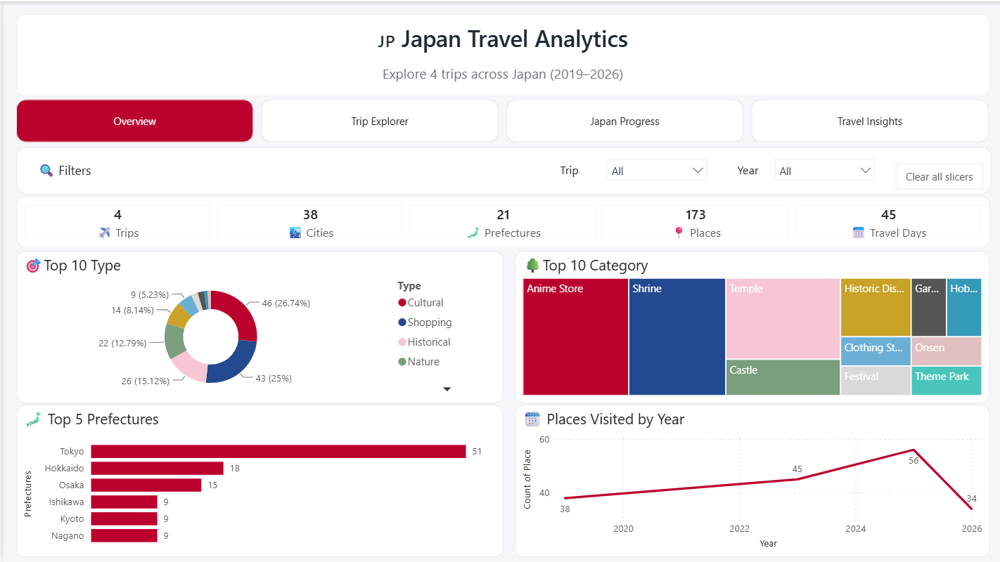
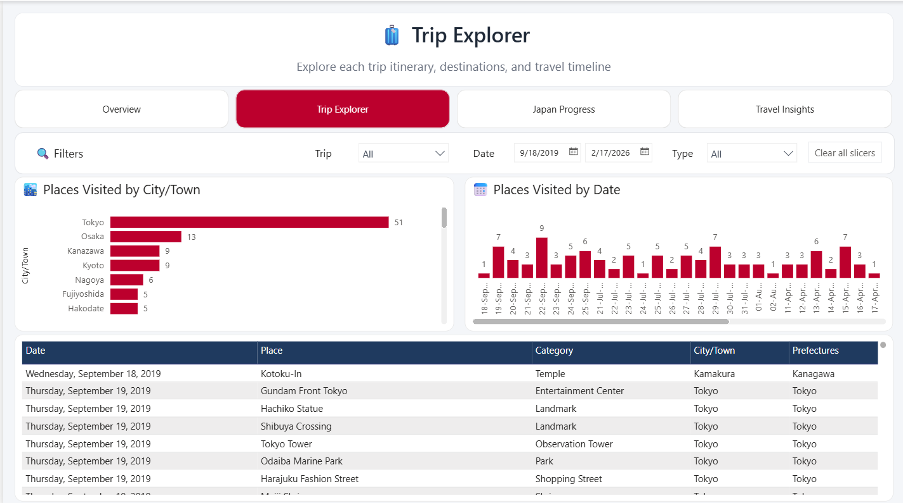
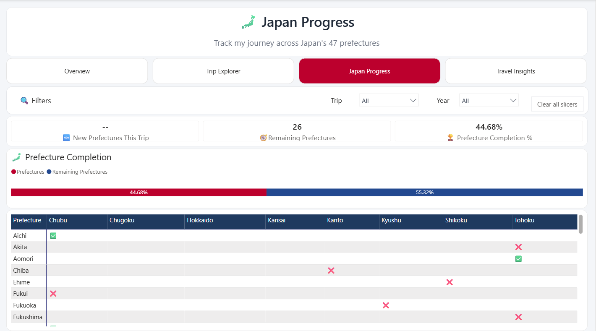

# 🇯🇵 Power BI Japan Travel Dashboard

An interactive Power BI dashboard that analyzes my travel history across Japan. This project demonstrates data visualization, dashboard design, data modeling, and DAX development using Power BI.

---

## 📌 Project Overview

This dashboard provides insights into my travel history across Japan by visualizing places visited, travel trends, prefecture coverage, and attraction categories.

The goal of this project was to transform raw travel records into an interactive dashboard that makes it easy to explore travel patterns and progress over time.

---

## 🛠️ Tools & Technologies

- Microsoft Power BI
- Power Query
- DAX
- Microsoft Excel

---

## 📊 Dashboard Features

- KPI cards for:
  - Total Trips
  - Places Visited
  - Prefectures Visited
  - Cities/Towns Visited

- Interactive map of visited locations

- Travel trends by year

- Top attraction categories

- Top cities/towns visited

- Prefecture completion tracker

- Interactive slicers and filters

- Dynamic DAX measures

---

## 📷 Dashboard Preview

### Overview

### Trip Explorer

### Japan Progress

### Seasonal Analysis

---

## 💡 Skills Demonstrated

- Data Modeling
- Data Cleaning (Power Query)
- DAX Measures
- Dashboard Design
- Data Visualization
- KPI Development
- Business Intelligence
- Analytical Storytelling

---

## 📁 Repository Contents

├── PowerBI_Japan_Travel_Dashboard.pbix

├── screenshots/

├── sample-data/

└── README.md

---

## 🚀 Future Enhancements

- Add travel cost analytics

---

## 👤 Author

Created by **Pyae Sone Khin** as part of my data analytics portfolio.
